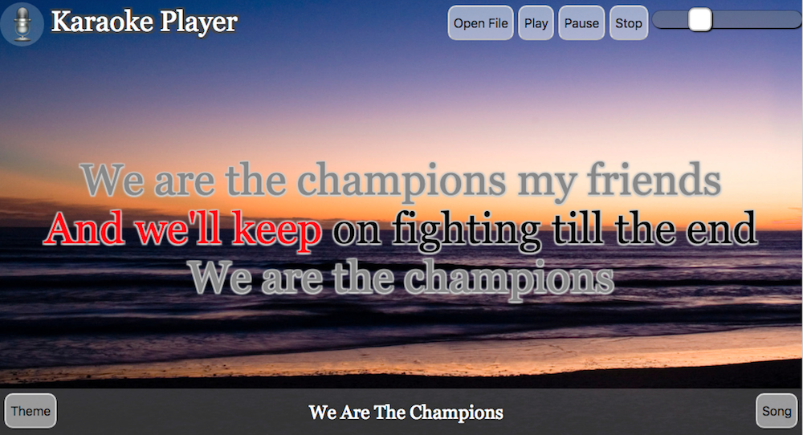
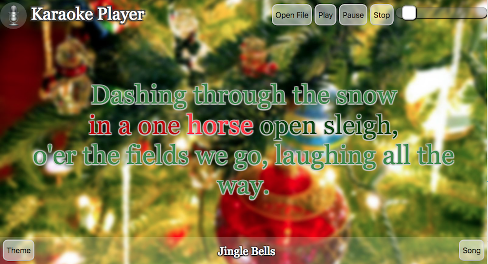

# Web Karaoke Player

A Web based Karaoke/MIDI player based on WEbMIDIAPI and WebAudio Soundfonts

## Features

* Open files from online playlist 
* Open files from local computer (.kar, .mid files)
* MIDI Player
  * Compatible with MIDI File type 0 & type 1
  * Uses WebMIDIAPI-based library to access MIDI Synthetized Soundfonts
  * Uees a Web-compatible SoundFonts based on [WebAudioFont](https://github.com/surikov/webaudiofont)
  * Based on [MidiPlayer project](https://github.com/fraigo/javascript-midi-player)
* Karaoke viewer
  * Reads MIDI format to extract Lyrics and tempo information
  * Real time Karaoke lyric drawing
  * Extensible support for CSS theming. Default with 3 theme presets.

## Online Demo

* [Master Project](https://fraigo.github.io/karaoke-player/)

* [Christmas Version](https://web-karaoke.herokuapp.com/)

